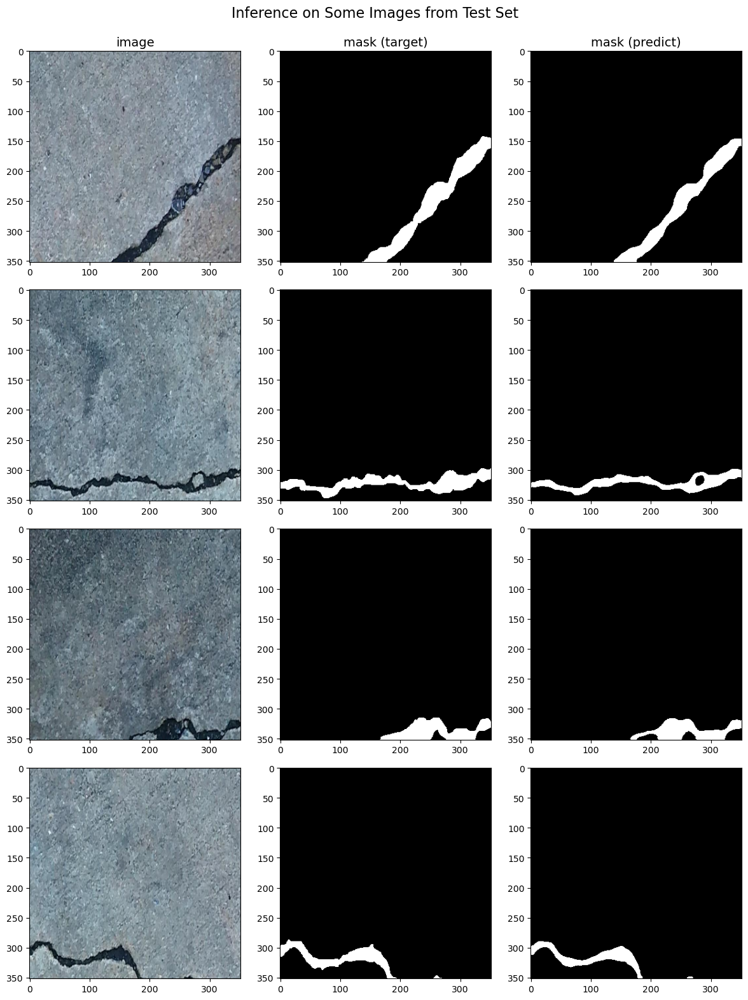

<div align="center">
  <p>
    <a align="center" href="" target="_blank">
      
    </a>
  </p>
  <br>

  <div align="center">
      <a href="https://github.com/tekboart/">
          
      </a>&nbsp;&nbsp;&nbsp;
      <a href="https://www.linkedin.com/in/kyan-bhr/">
          
      </a>&nbsp;&nbsp;&nbsp;
      <a href="https://scholar.google.com/citations?user=r3xmjQUAAAAJ&hl=en">
          
      </a>&nbsp;&nbsp;&nbsp;
      <a href="https://www.kaggle.com/tekboart">
          
      </a>&nbsp;&nbsp;&nbsp;
  </div>
</div>

<hr height="10">

# Crack Binary Segmentation Using Deep Learning Computer Vision


## Description
Used several semantic segmentation models (i.e., UNet++, FPN, DeepLabV3+) with different CNN encoders, pre-trained with 12M ImageNet dataset, to detect cracks in built environment images (e.g., bridges, infrastructures, pavement, etc.) with quite favorable results (See Figure [[1]](#1)).

<p align="center">
    
    <p align="center"><b>Fig <a id="1">[1]</a> :</b> A few sample inference results of the Test set images.</p>
</p>


## Requirements


- Please refer to the file `requirements.txt` for a comprehensive list of packages and their corresponding version.

## Project Dir Structure (only 2 level)
```bash
.
.
├── data
│   ├── testcrop
│   ├── testdata
│   └── traincrop
├── images
├── logs
├── models
├── outputs
│   ├── history
│   ├── hyperparams
│   ├── hyperparams_search
│   ├── Inferences
│   └── plots
├── reports
├── runs
├── temp
└── utils
    └── models


58 directories
```

## Contact
<!-- Unfortunately this repo is no longer actively maintained.  -->
Should you have any questions, feel free to contact TekBoArt @tekboart.


## License
<!-- Creative Common Licenses -->
<!-- "Creative Commons Attribution-NonCommercial-ShareAlike (CC-BY-NC-SA)" -->
Shield: [![CC BY-NC-SA 4.0][cc-by-nc-sa-shield]][cc-by-nc-sa]

<!-- MIT License (can be used commercially) -->
<!-- Shield: [](https://opensource.org/licenses/MIT) -->

- Refer to the file `LICENSE` for more information regarding the license of this repository.

This work is licensed under a
[Creative Commons Attribution-NonCommercial-ShareAlike 4.0 International License][cc-by-nc-sa].

[![CC BY-NC-SA 4.0][cc-by-nc-sa-image]][cc-by-nc-sa]

[cc-by-nc-sa]: http://creativecommons.org/licenses/by-nc-sa/4.0/
[cc-by-nc-sa-image]: https://licensebuttons.net/l/by-nc-sa/4.0/88x31.png
[cc-by-nc-sa-shield]: https://img.shields.io/badge/License-CC%20BY--NC--SA%204.0-lightgrey.svg
